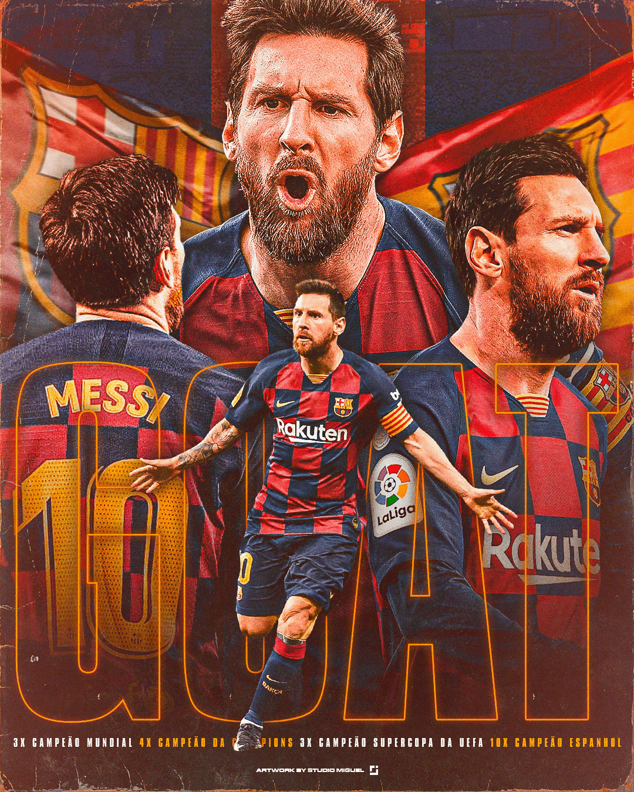
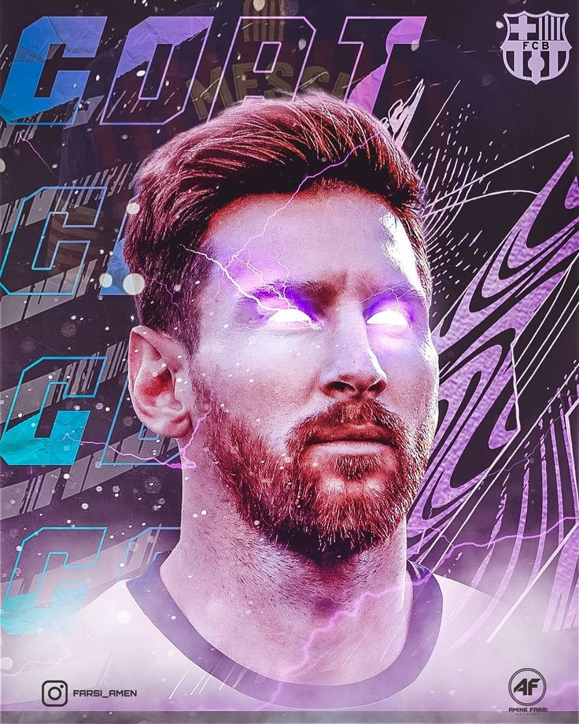
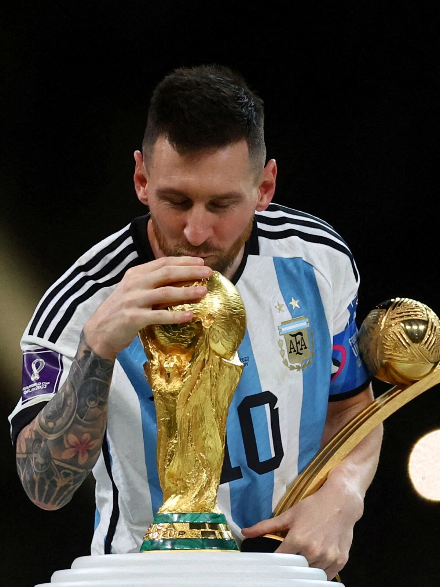
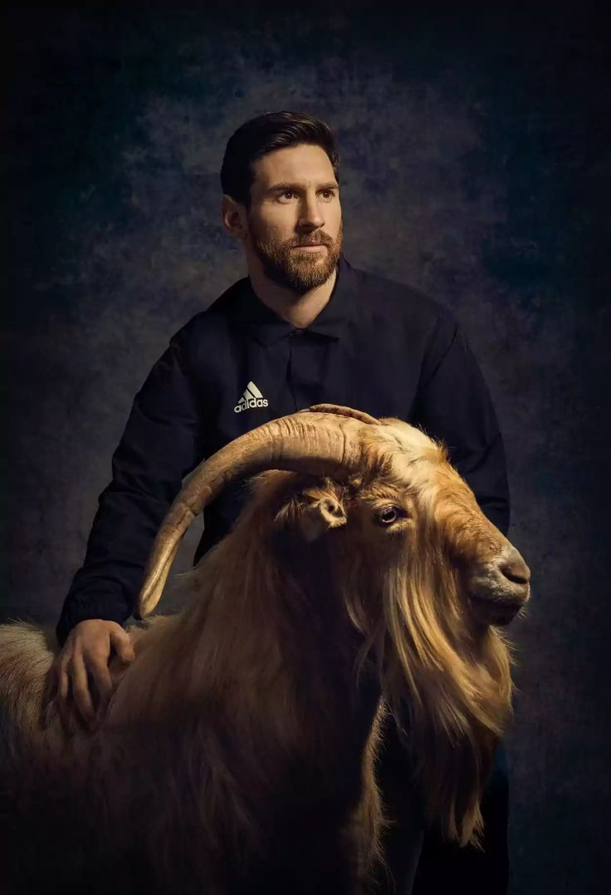

<!DOCTYPE html>
<html lang="en">
<head>
    <meta charset="UTF-8">
    <meta name="viewport" content="width=device-width, initial-scale=1.0">
    <title>Messi Fan Website</title>
    <link rel="stylesheet" href="styles.css">
    <link href="https://fonts.googleapis.com/css2?family=Roboto:wght@400;700&display=swap" rel="stylesheet">
    <link rel="stylesheet" href="https://cdnjs.cloudflare.com/ajax/libs/font-awesome/6.0.0-beta3/css/all.min.css" integrity="sha384-5e2ESR8Ycmos6g3gAKr1Jvwye8sW4U1u/cAKulfVJnkakCcMqhOudbtPnvJ+nbv7" crossorigin="anonymous">
    
</head>
<body>
    <header>
        <nav>
            
Messi Fan Website 

            <ul class="nav-links">
                <li><a href="#about">About</a></li>
                <li><a href="#career">Career</a></li>
                <li><a href="#achievements&Records">Achievements & Records</a></li>
                <li><a href="#gallery">Gallery</a></li>
                <li><a href="#contact">Contact</a></li>
            </ul>
            

                <i class="fas fa-bars"></i>
            

        </nav>
    </header>
    <section id="hero">
        <h1>Welcome to Lionel Messi's Fan Website</h1>
        
The Greatest of All Time

    </section>
    <section id="about">
        <h2>About Messi</h2>
        
Born in Rosario, Argentina, in 1987, Lionel Messi is widely regarded as one of the greatest football players of all time, and his illustrious career proves why. The Argentinean footballer, who holds a record eight Ballon d'Or awards, has displayed his talent early on and has always been destined for greatness.

            When Messi was 13 years old, he and his family moved to Barcelona, where the club assisted him in treating his growth hormone deficiency. He started playing for FC Barcelona's U14 team. The Argentinean quickly rose through the ranks, impressing everyone with exceptional skills and talent. At 17, he made his first senior appearance for the club and became a vital player for the Blaugranas.
            
            The Rosario's native relationship with Barcelona was very successful. During his 17-year career with the team, he helped them win numerous titles, including 10 La Liga titles, four Champions League crowns, and seven Copa del Rey trophies. He is also the all-time leading scorer in La Liga, with an incredible 474 goals to his name. He left the Spanish club in 2021 to join French powerhouse Paris Saint Germain, where he played two years before joining Inter Miami in the MLS.

    </section>
    <section id="career">
        <h2>Career</h2>
        
Messi began his career with FC Barcelona and has won numerous titles and awards.Lionel Messi is an Argentine professional footballer.

            He plays as a forward and captain both Inter Miami C.F. and the Argentina National Football Team. Considered the best player in the world and regarded as one of the greatest players of all time, Messi has won a record eight Ballon d'Or awards and a record six European Golden Shoes. He has spent his entire professional career with FC Barcelona, where he has won a club-record 34 trophies, including ten La Liga titles, four UEFA Champions League (1992) titles and six Copas del Rey. Messi holds the records for most goals in La Liga (474), a La Liga and European league season (50), most hat-tricks in La Liga (36) and the UEFA Champions League (1992) (8). He has scored over 900 senior career goals for club and country.
            
            An Argentine international, Messi is his country's all-time leading goalscorer. At youth level, he won the FIFA U-20 World Cup 2005 (2005), finishing the tournament with both the Golden Ball and Golden Shoe, and an Olympic gold medal at the Beijing 2008: Games of the XXIX Olympiad (2008). After his senior debut in August 2005, Messi became the youngest Argentine to play and score in a 2006 FIFA World Cup Germany (2006), and reached the final of the 2007 Copa América, where he was named young player of the tournament.
            
            As the squad's captain from August 2011, he led Argentina to three consecutive finals: the 2014 FIFA World Cup Brazil (2014), for which he won the Golden Ball, and the Copa América 2015 (2015) and Copa América Centenario (2016). After announcing his international retirement in 2016, he reversed his decision and led his country to qualification for the 2018 FIFA World Cup Russia (2018), and a third-place finish at the Copa América Brasil 2019 (2019). In the 1/8 finals match of 2018 FIFA World Cup Russia (2018) against the future winner of the tournament, France National Football Team, Messi gave two assists, but the Argentines lost with a score of 3:4 and ended their participation in the tournament.
            
            On July 10, 2021 the Argentina National Football Team beat Brazil in the final of Copa America 2021 (2021) with a score of 1:0. Thus, Lionel Messi won his first trophy with the national team. He also became the tournament's top scorer (shared with Luis Fernando Díaz from Colombia).
            
            In the final match of 2022 FIFA World Cup Qatar (2022) against France in the first half, Messi opened the scoring from the penalty spot. Regular time ended with the score 2:2, at the beginning of the second extra period Messi put Argentina ahead. However, Kylian Mbappé managed to level the score from the penalty spot, scoring his third goal of the game (3:3). In the penalty shoot-out, Messi was the first to beat for Argentines and converted his shot. As a result, the Argentines won the series with a score of 4:2 and became three-time world champions. Messi was named the best player of the match and was also named the best player of the tournament overall

    </section>
    <section id="achievements&Records">
        <h2>Achievements</h2>
        <ul>
            <li>1 FIFA World Cup</li>
            <li>2 World Cup Golden Ball</li>
            <li>1 Copa America</li>
            <li>1 Finalissima</li>
            <li>1 U-20 World Cup</li>
            <li>1 Beijing Olympic Games Gold Medal</li>
            <li>8 Ballon d'Or awards</li>
            <li>6 Golden Shoes</li>
            <li>10 La Liga titles</li>
            <li>4 Champions League titles</li>
            <li>3 Club World Cup</li>
            <li>7 Copa del Rey</li>
            <li>3 European Super Cup</li>
            <li>8 Supercopa de Espana</li>
            <li>2 Ligue 1</li>
            <li>2 Men's Player of the Year</li>
            
        </ul>
         
        <h2> Records</h2>
        <ul>
            <li>All-time top scorer at same club</li>
            <li>FC Barcelona all-time top goalscorer</li>
            <li>All-time top goalscorer in LaLiga</li>
            <li>Top goalscorer in the 21st century</li>
            <li>Top goalscorer in El Clásico</li>
            <li>Guinness World Record as top goalscorer for club (91 goals)</li>
            <li>All time top scorer of national teams in South America</li>
            <li>MVP of the 2014 World Cup and the 2022 World Cup</li> 
            <li>Most games played as a Barcelona player in its history</li>
            <li>Most trophies won as a Barcelona player</li>
            <li>Most goals in a LaLiga season (50 goals)</li> 
            <li>All-time top goalscorer in the Champions with the same team</li>
            <li>Most games played with Argentina in its history</li>
            <li>Argentinian with most honours</li>
            <li>The game's all-time leading Argentine goalscorer</li>
            
            
        </ul>
    </section>
    <section id="gallery">
        <h2>Gallery</h2>
        

            
            
            
            
        

    </section>
    <section id="contact">
        <h2>Contact</h2>
        <form id="contact-form">
            <input type="text" name="name" placeholder="Your Name" autocomplete="name" required>
            <input type="email" name="email" placeholder="Your Email" autocomplete="email" required>
            <textarea name="message" placeholder="Your Message" autocomplete="off" required></textarea>
            <button type="submit">Send</button>
        </form>  
    </section>
    <footer>
        
Website Created by Somak

        
&copy; 2024 Messi Fan Website 

    </footer>
    
    
</body>
</html>

all these html codes are coded for messi fan website
